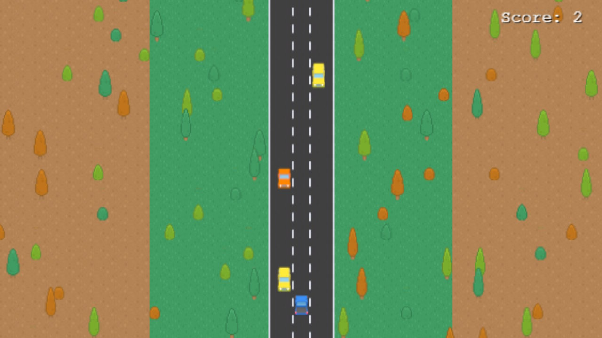

# Road Brawler

A simple racing game inspired by the classic _Road Fighter_ game.

[Play the game here](https://jfmdev.github.io/road-brawler/)

## Getting Started

The project was created using the [vite-phaser-ts](https://github.com/iwantantra/vite-phaser-ts) template, which provides the following scripts:

* `npm run dev` to run the project locally.
* `npm run build` to build the project.
* `npm run preview` to preview the build.
* `npm run lint` to lint check your code using eslint.
* `npm run lint-fix` to lint check and fix your code.

## Sprites

The sprites used on this project were designed by [Kenney.nl](https://opengameart.org/content/roguelike-modern-city-pack) and [eracoon](https://opengameart.org/content/isometric-vehicles).

## License

Road Brawler is free software; you can redistribute it and/or modify it under the terms of the Mozilla Public License v2.0. You should have received a copy of the MPL 2.0 along with this software, otherwise you can obtain one at http://mozilla.org/MPL/2.0/.